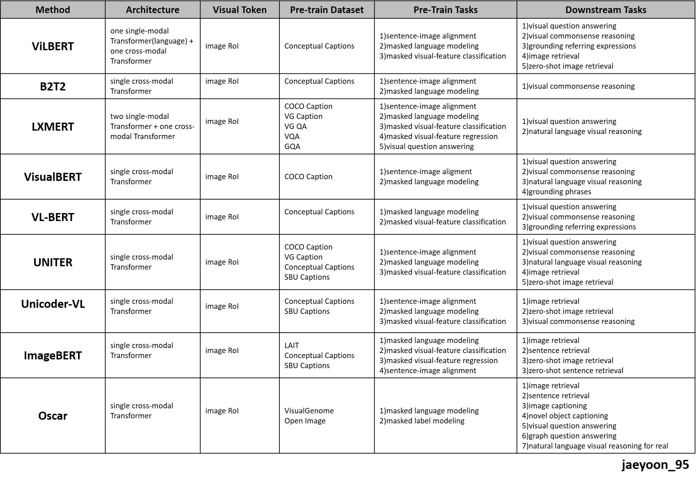

## Pretrained model summary   
* ### [pretrained language model](#pretrained-language-model)   
* ### [pretrained image model](#pretrained-image-model)   
* ### [pretrained video model](#pretrained-video-model)   
* ### [pretrained image and language model](#pretrained-image-and-language-model)   
* ### [pretrained video and language model](#pretrained-video-and-language-model)   
* ### [pretrained knowledge and language model](#pretrained-knowledge-and-language-model)   
---
## pretrained language model   
|**title**|**paper link**|**code link**|
|---|:---:|:---:|
|Improving Language Understanding by Generative Pre-Training|[[paper]](https://s3-us-west-2.amazonaws.com/openai-assets/research-covers/language-unsupervised/language_understanding_paper.pdf)|[[code(pytorch)]](https://github.com/huggingface/transformers)|
|ELMo : Deep contextualized word representations|[[paper]](https://arxiv.org/pdf/1802.05365.pdf)|[[code(tensorflow)]](https://github.com/yuanxiaosc/ELMo)|
|BERT: Pre-training of Deep Bidirectional Transformers for Language Understanding|[[paper]](https://arxiv.org/pdf/1810.04805.pdf)|[[code(tensorflow)]](https://github.com/google-research/bert)[[code(pytorch)]](https://github.com/codertimo/BERT-pytorch)|
|ALBERT: A LITE BERT FOR SELF-SUPERVISED LEARNING OF LANGUAGE REPRESENTATIONS|[[paper]](https://arxiv.org/pdf/1909.11942.pdf)|[[code(tensorflow)]](https://github.com/google-research/albert)[[code(pytorch)]](https://github.com/graykode/ALBERT-Pytorch)|
|RoBERTa: A Robustly Optimized BERT Pretraining Approach|[[paper]](https://arxiv.org/pdf/1907.11692.pdf)|[[code[pytorch]]](https://github.com/pytorch/fairseq/tree/master/examples/roberta)|
|Language Models are Unsupervised Multitask Learners|[[paper]](https://d4mucfpksywv.cloudfront.net/better-language-models/language-models.pdf)|[[code(tensorflow)]](https://github.com/openai/gpt-2)|
|Language Models are Few-Shot Learners|[[paper]](https://arxiv.org/pdf/2005.14165.pdf)|[[code]](https://github.com/openai/gpt-3)|
|XLNet: Generalized Autoregressive Pretraining for Language Understanding|[[paper]](https://arxiv.org/pdf/1906.08237.pdf)|[[code(tensorflow)]](https://github.com/zihangdai/xlnet)|
---
## pretrained image model   
|**title**|**paper link**|**code link**|
|---|:---:|:---:|
|Identity Mappings in Deep Residual Networks|[[paper]](https://arxiv.org/pdf/1603.05027.pdf)|[[code]](https://github.com/KaimingHe/resnet-1k-layers)|
|Faster R-CNN: Towards Real-Time Object Detection with Region Proposal Networks|[[paper]](https://arxiv.org/pdf/1506.01497.pdf)|[[code(pytorch)]](https://github.com/longcw/faster_rcnn_pytorch)|
|Mask R-CNN|[[paper]](https://arxiv.org/pdf/1703.06870.pdf)|[[code(tensorflow)]](https://github.com/matterport/Mask_RCNN)[[code(pytorch)]](https://github.com/facebookresearch/maskrcnn-benchmark)|
|You Only Look Once: Unified, Real-Time Object Detection|[[paper]](https://arxiv.org/pdf/1506.02640.pdf)|[[code(tensorflow)]](https://github.com/gliese581gg/YOLO_tensorflow)|
|YOLOv3: An Incremental Improvement|[[paper]](https://pjreddie.com/media/files/papers/YOLOv3.pdf)|[[code(tensorflow)]](https://github.com/YunYang1994/tensorflow-yolov3)[[code(pytorch)]](https://github.com/ultralytics/yolov3)|   
|YOLOv4: Optimal Speed and Accuracy of Object Detection|[[paper]](https://arxiv.org/pdf/2004.10934v1.pdf)|[[code(tensorflow)]](https://github.com/hunglc007/tensorflow-yolov4-tflite)|  

---   
## pretrained video model   
|**title**|**paper link**|**code link**|
|---|:---:|:---:|
|Looking Fast and Slow: Memory-Guided Mobile Video Object Detection|[[paper]](https://arxiv.org/pdf/1903.10172v1.pdf)|[[code(tensorflow)]](https://github.com/tensorflow/models)|
|Context R-CNN: Long Term Temporal Context for Per-Camera Object Detection|[[paper]](https://arxiv.org/pdf/1912.03538v3.pdf)|[[code(tensorflow)]](https://github.com/tensorflow/models)|
|Optimizing Video Object Detection via a Scale-Time Lattice|[[paper]](https://arxiv.org/pdf/1804.05472v1.pdf)|[[code(pytorch)]](https://github.com/guanfuchen/video_obj)|
|Mobile Video Object Detection with Temporally-Aware Feature Maps|[[paper]](https://arxiv.org/pdf/1711.06368v2.pdf)|[[code(pytorch)]](https://github.com/thstkdgus35/EDSR-PyTorch)|
|X3D: Expanding Architectures for Efficient Video Recognition|[[paper]](https://arxiv.org/pdf/2004.04730v1.pdf)|[[code(pytorch)]](https://github.com/facebookresearch/SlowFast)|

---   
## pretrained image and language model   
### summary table   
   

### papaer and code
|**title**|**paper link**|**code link**|
|---|:---:|:---:|
|ViLBERT: Pretraining Task-Agnostic Visiolinguistic Representations for Vision-and-Language Tasks|[[paper]](https://arxiv.org/pdf/1908.02265.pdf)|[[code(pytorch)]](https://github.com/jiasenlu/vilbert_beta)|
|12-in-1: Multi-Task Vision and Language Representation Learning|[[paper]](https://arxiv.org/pdf/1912.02315.pdf)|[[code(pytorch)]](https://github.com/facebookresearch/vilbert-multi-task)|
|LXMERT: Learning Cross-Modality Encoder Representations from Transformers|[[paper]](https://arxiv.org/pdf/1908.07490.pdf)|[[code(pytorch)]](https://github.com/airsplay/lxmert)|
|VISUALBERT: A SIMPLE AND PERFORMANT BASELINE FOR VISION AND LANGUAGE|[[paper]](https://arxiv.org/pdf/1908.03557.pdf)|[[code(pytorch)]](https://github.com/uclanlp/visualbert)|
|VL-BERT: Pre-training of Generic Visual-Linguistic Representations|[[paper]](https://arxiv.org/pdf/1908.08530.pdf)|[[code(pytorch)]](https://github.com/jackroos/VL-BERT)|
|UNITER: LEARNING UNIVERSAL IMAGE-TEXT REPRESENTATIONS|[[paper]](https://arxiv.org/pdf/1909.11740.pdf)|[[code(pytorch)]](https://github.com/ChenRocks/UNITER)|
|Unicoder-VL: A Universal Encoder for Vision and Language by Cross-modal Pre-training|[[paper]](https://arxiv.org/pdf/1908.06066.pdf)|[[code(pytorch)]](https://github.com/microsoft/Unicoder)|
|Large-Scale Adversarial Training for Vision-and-Language Representation Learning|[[paper]](https://arxiv.org/pdf/2006.06195.pdf)|[[code(pytorch)]](https://github.com/zhegan27/VILLA)|
|Fusion of Detected Objects in Text for Visual Question Answering|[[paper]](https://arxiv.org/pdf/1908.05054.pdf)|[[code(tensorflow)]](https://github.com/google-research/language/tree/master/language/question_answering/b2t2)|
|ERNIE-ViL: Knowledge Enhanced Vision-Language Representations Through Scene Graph|[[paper]](https://arxiv.org/pdf/2006.16934.pdf)|[code]|

---
## pretrained video and language model   
|**title**|**paper link**|**code link**|
|---|:---:|:---:|
|VideoBERT: A Joint Model for Video and Language Representation Learning|[[paper]](https://arxiv.org/pdf/1904.01766.pdf)|[code]|
|UniVL: A Unified Video and Language Pre-Training Model for Multimodal Understanding and Generation|[[paper]](https://arxiv.org/pdf/2002.06353.pdf)|[code]|
|Multi-modal Circulant Fusion for Video-to-Language and Backward|[[paper]](https://www.ijcai.org/Proceedings/2018/0143.pdf)|[code]|
|Video-Grounded Dialogues with Pretrained Generation Language Models|[[paper]](https://arxiv.org/pdf/2006.15319.pdf)|[code]|
|Deep Extreme Cut: From Extreme Points to Object Segmentation|[[paper]](https://arxiv.org/pdf/1711.09081)|[[code(pytorch)]](https://github.com/scaelles/DEXTR-PyTorch)|
|Integrating Multimodal Information in Large Pretrained Transformers|[[paper]](https://arxiv.org/pdf/1908.05787.pdf)|[[code(pytorch)]](https://github.com/dongjunn/MBERT)|
|Improving LSTM-based Video Description with Linguistic Knowledge Mined from Text|[[paper]](https://arxiv.org/pdf/1604.01729.pdf)|[[code(caffe)]](https://github.com/vsubhashini/caffe/tree/recurrent/examples/language_fusion)|

---
## pretrained knowledge and language model   
|**title**|**paper link**|**code link**|
|---|:---:|:---:|
|Knowledge Enhanced Contextual Word Representations|[[paper]](https://arxiv.org/pdf/1909.04164.pdf)|[[code(pytorch)]](https://github.com/allenai/kb)|
|Why Do Masked Neural Language Models Still Need Commonsense Repositories to Handle Semantic Variations in Question Answering? |[[paper]](https://arxiv.org/pdf/1911.03024.pdf)|[code]|
|SentiLARE: Sentiment-Aware Language Representation Learning with Linguistic Knowledge|[[paper]](https://www.aclweb.org/anthology/2020.emnlp-main.567.pdf)|[[code]](https://github.com/thu-coai/SentiLARE/issues)|
|Acquiring Knowledge from Pre-trained Model to Neural Machine Translation|[[paper]](https://arxiv.org/pdf/1912.01774.pdf)|[[code]](https://github.com/wengrx/APT-NMT)|
|Knowledge-Aware Language Model Pretraining|[[paper]](https://arxiv.org/pdf/2007.00655.pdf)|[code]|
